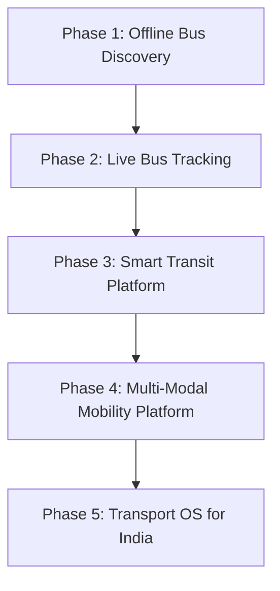
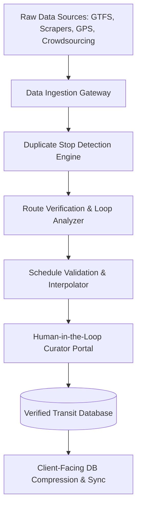
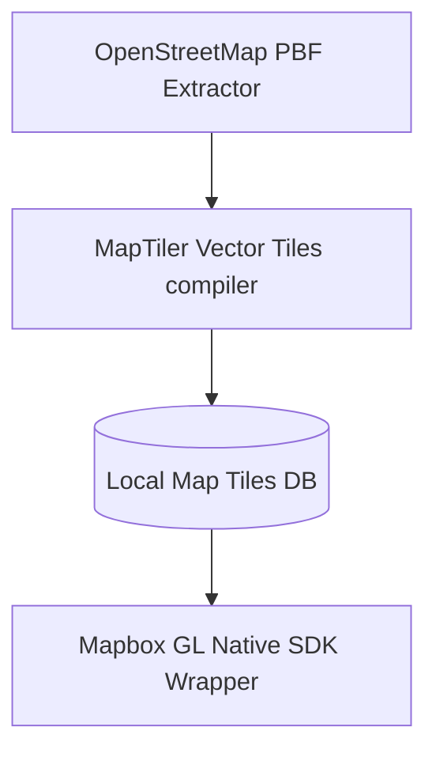
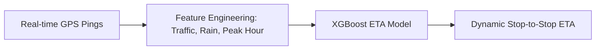
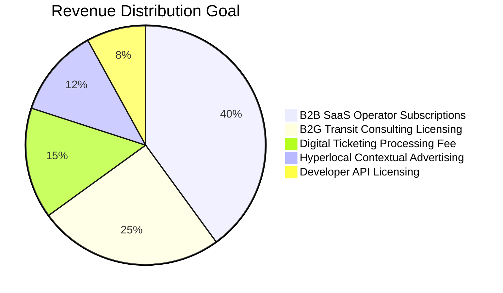
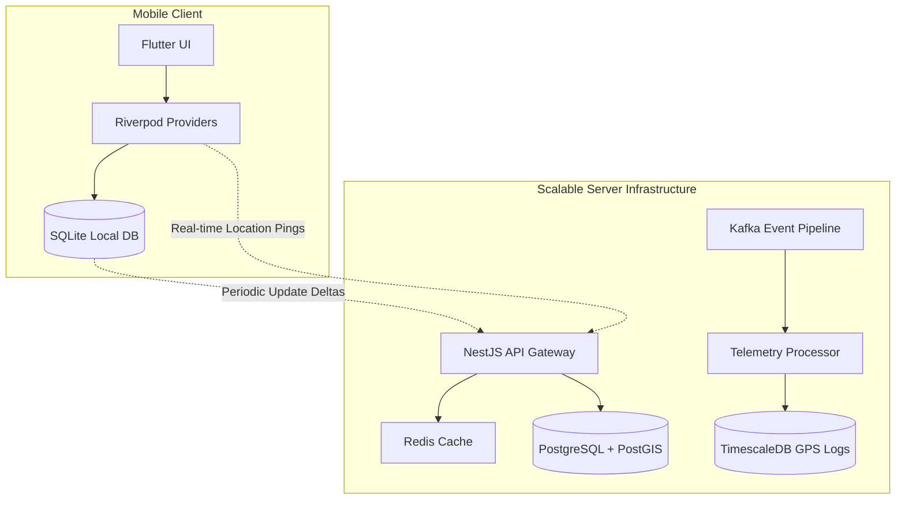
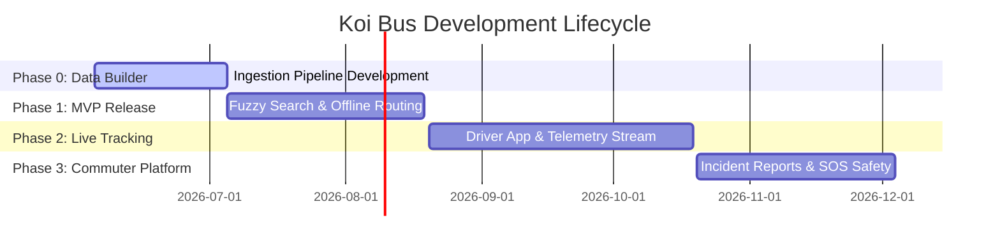

# Koi Bus: Master Product & Engineering Blueprint
## Intelligent, Offline-First Public Transport Infrastructure for India

---

# 1. Product Vision & Phased Evolution

Koi Bus is conceptualized not just as an app, but as the foundational digital nervous system for public transit in India, starting with West Bengal. The platform targets the highly fragmented, semi-formal, and heavily relied-upon public bus networks which transport tens of millions daily but lack any cohesive digital infrastructure.



### Phase 1: Offline Bus Discovery (Core MVP)
- **Objective**: Establish a baseline utility by mapping routes and schedules without requiring cellular data.
- **Focus**: Solve the discoverability crisis. Commuters do not know which private or public bus numbers connect arbitrary points, where the stops are, or what the fares look like.
- **Key Capability**: Prepackaged, highly compressed local SQLite relational database that operates 100% offline, offering fuzzy search, stop listings, route tables, and offline multimodal search.
- **Target Audience**: Daily commuters in sub-urban and rural areas of West Bengal experiencing spotty 2G/3G connectivity.

### Phase 2: Live Bus Tracking (Crowdsourced + Telematics)
- **Objective**: Introduce real-time certainty to transit timetables.
- **Focus**: Reduce waiting times at bus stops.
- **Key Capability**: Implement a hybrid telemetry capture network. Collect GPS location data from:
  1. Drivers running the companion driver app.
  2. Active passenger app sessions via anonymized, low-power GPS triangulation (commuters on the bus reporting speed/location).
  3. Integrations with government transport agency GPS feeds (WBTC, SBSTC).
- **Target Audience**: Urban and semi-urban commuters who need precise ETA estimations before leaving home/office.

### Phase 3: Smart Transit Platform (Ecosystem Integration)
- **Objective**: Digitally unify the transit transaction and informational space.
- **Focus**: Tickets, passes, and high-fidelity passenger feedback.
- **Key Capability**: Introduce UPI-based dynamic QR ticketing, digital monthly passes, and smart queues. Introduce the **Community Trust Score** system where user-reported delays, overcrowding, accidents, and route changes form a reliable real-time incident dashboard.
- **Target Audience**: Regular commuters looking for paperless ticketing and reliable crowdsourced status updates.

### Phase 4: Multi-Modal Mobility Platform
- **Objective**: Solve end-to-end journey planning.
- **Focus**: Last-mile connectivity and inter-city commutes.
- **Key Capability**: Integrate the suburban rail network (Eastern Railway, South Eastern Railway), the Kolkata Metro lines, auto-rickshaw routes (para-transit), and walking routing. 
- **Algorithm**: Multi-modal Dijkstra/A* routing that allows journey chains like:
  $$\text{Home} \xrightarrow{\text{Walk}} \text{Local Auto Stand} \xrightarrow{\text{Auto}} \text{Bus Depot} \xrightarrow{\text{Bus}} \text{Metro Station} \xrightarrow{\text{Metro}} \text{Destination}$$
- **Target Audience**: Inter-district and long-distance commuters switching transit modes multiple times per journey.

### Phase 5: Transport Operating System for India (Enterprise/Gov B2B)
- **Objective**: Transition from B2C utility to the national B2G/B2B infrastructure standard.
- **Focus**: Fleet management, operational optimization, and smart city data intelligence.
- **Key Capability**: Licensable SaaS portals for private operator syndicates and state transport corporations (NBSTC, SBSTC). Dynamic rescheduling engines powered by historical traffic patterns, route passenger density mapping, billing/subsidy dispatch engines for the government, and API licensing for third-party logistics and delivery platforms.

---

# 2. Data Acquisition Strategy & Quality Pipeline

Transit data in India is highly unstructured, constantly changing, and undocumented. Developing a robust Data Acquisition Pipeline is the single most critical asset for Koi Bus.



### Ingestion Sources
1. **State Transport Undertaking (STU) Feeds**: Intermittent GTFS static feeds or raw PDFs scraped from WBTC (West Bengal Transport Corporation), SBSTC (South Bengal), and NBSTC (North Bengal).
2. **Private Operator Syndicates**: Digitization of paper timetables maintained by private bus unions (which operate over 85% of routes in West Bengal) using Optical Character Recognition (OCR) tools and field personnel input.
3. **Driver-Contributed GPS Tracks**: Aggregated breadcrumbs of driven routes from telemetry apps to draw the physical paths (polylines) of buses where coordinates are missing.
4. **Passenger Crowdsourcing**: Real-time correction requests submitted when stops are misplaced or route paths change due to physical road modifications.

### Data Verification Pipeline
To prevent corrupting the local database, all incoming geographic and temporal data undergoes a strict automated validation pipeline:

- **Duplicate Stop Detection (DBSCAN Clustering)**: Stops within a 15-meter radius with lexicographically similar names (e.g., "Salt Lake Karunamoyee" vs. "Karunamoyee Bus Terminus") are flagged for merging. We calculate the Levenshtein distance for name metrics and geodesic distance (Haversine formula) for positioning.
- **Route Loop and Self-Intersection Analysis**: Path coordinates (polylines) are audited to ensure they do not contain illogical loops or sharp spikes, which indicate erroneous GPS logs.
- **Schedule Interpolation & Validation**: Ensures bus speeds between stops do not exceed physically impossible rates (e.g., a bus traveling at $120 \text{ km/h}$ through urban traffic). Missing intermediate stop timings are calculated via linear interpolation adjusted by historical time-of-day traffic matrices.

### Data Quality Score (DQS) Formula
Every route in the database is assigned a Data Quality Score (DQS) from $0$ to $100$:

$$\text{DQS} = w_1 \cdot \text{V}_p + w_2 \cdot \text{V}_t + w_3 \cdot \text{U}_f + w_4 \cdot \text{C}_r$$

Where:
- $\text{V}_p$: Path geometry accuracy (verified coordinate density).
- $\text{V}_t$: Timing schedule verification rating (static timetables vs. historical GPS runs).
- $\text{U}_f$: Recency factor (days since last update).
- $\text{C}_r$: User validation score (positive feedback on route correctness).
- $w_1, w_2, w_3, w_4$: Weight matrices ($0.3$, $0.3$, $0.2$, $0.2$).

Routes falling below a DQS of 60 are flagged for manual review and hidden from optimized routing recommendations to prevent bad passenger experiences.

---

# 3. Bus Tracking Evolution

Real-time bus tracking is critical but challenging in a landscape dominated by budget constraints. Koi Bus implements a tiered telemetry model:

| Parameter | Stage 1: Driver App GPS | Stage 2: Passenger Crowdsourcing | Stage 3: Dedicated OBD-II / Telematics |
| :--- | :--- | :--- | :--- |
| **Capital Cost (CAPEX)** | Low (Uses existing driver phone) | Zero | High (~$30-50 per vehicle hardware) |
| **Operating Cost (OPEX)** | Low (Data packages) | Zero | Medium (SIM subscription per unit) |
| **Telemetry Quality** | High (Continuous ping) | Medium (Variable density) | Extremely High (99.9% uptime, engine telemetry) |
| **Friction / Trust** | Medium (Requires driver compliance) | Low (Handled automatically in background) | Zero (Automated hardware startup) |
| **Implementation Plan**| Deploy to private bus unions first | Scale app to passenger base | Target government luxury/long-distance fleets |

### Stage 1 Architecture: Battery-Optimized Driver Telemetry
Drivers run a lightweight foreground background-service app. To preserve battery on cheap devices:
- **Adaptive Sampling**: Pings GPS every 5 seconds when moving ($> 10\text{ km/h}$), dial back to once every 60 seconds when stationary (detected using accelerometer sleep thresholds).
- **Network Resiliency**: If cell tower connection is lost (common on rural West Bengal highways), telemetry packets are written to a local SQLite buffer and dispatched as a compressed batch once network coverage is restored.

### Stage 2 Architecture: Anonymized Passenger Telemetry
When an active passenger travels on a bus, the app identifies proximity to a route path and begins tracking.
- **Transit Mode Detection**: Using the device's sensor fusion (accelerometer + GPS velocity), the system checks if the movement pattern matches a transit vehicle.
- **Anonymized Beaconing**: The device uploads low-frequency coordinates. The backend maps these traces to a running route instance, updating the estimated time of arrival (ETA) for subsequent passengers without the driver running any app.

---

# 4. Transit Intelligence Engine & Routing Algorithms

Journey planning across complex network graphs requires algorithms capable of running on resource-constrained devices offline, as well as highly optimized models on cloud infrastructure.


### Graph Formulation
The transport network is modeled as a directed, time-dependent, multi-modal graph $G = (V, E)$, where:
- $V$: Nodes representing physical bus stops, metro stations, and train platforms.
- $E$: Directed edges representing travel segments between stops (with associated routes) or walking transfers.

### Multi-Criteria Cost Function ($C$)
The edge weight is not just travel time; it is a multi-dimensional cost vector:

$$C(e) = t_{\text{travel}} + \alpha \cdot t_{\text{wait}} + \beta \cdot N_{\text{transfers}} + \gamma \cdot \text{Fare} + \delta \cdot \text{CrowdFactor}$$

Where:
- $\alpha$: Waiting time penalty multiplier (commuters perceive waiting as twice as frustrating as traveling; default $\alpha = 2.0$).
- $\beta$: Transfer penalty (default $\beta = 10 \text{ minutes}$ equivalent).
- $\gamma$: User fare budget sensitivity weight.
- $\delta$: Crowding cost coefficient (penalizes highly crowded buses for comfort optimization).

### Algorithm Strategy
1. **Offline Engine (Mobile client)**: Uses a localized **Connection Scan Algorithm (CSA)**. CSA bypasses traditional graph traversal (like Dijkstra) by sorting trips chronologically and scanning them linearly. It is extremely fast, demands very low memory footprint, and runs efficiently on 5-year-old budget Android chipsets inside the local SQLite runtime.
2. **Online Engine (Cloud backend)**: Employs **Contraction Hierarchies (CH)** combined with **A\* Search** using geographical distance heuristics. Contraction hierarchies precompute shortcut edges between major transit hubs (e.g., Howrah Station, Esplanade, Karunamoyee), accelerating query responses to $< 50\text{ ms}$ for multi-modal journeys across the entire state.

---

# 5. Connected Journey Planning (Multimodal Transfers)

For complex, long-distance commutes in West Bengal, single-bus journeys are rare. Commuters often link modes:

$$\text{Sonamukhi (Bankura)} \xrightarrow{\text{District Bus}} \text{Burdwan Station} \xrightarrow{\text{Local Train}} \text{Howrah Station} \xrightarrow{\text{Ferry/Metro}} \text{Salt Lake Sector V}$$

### Transfer Interchange Logic
To make transfers viable, the routing engine implements a strict spatial-temporal buffer system:
- **Minimum Transfer Time (MTT)**: Dynamic based on the physical size of the transfer stop. Transferring at a large station (e.g., Howrah Station) requires a minimum walk/buffer window of 15 minutes, whereas a simple roadside stop requires only 3 minutes.
- **Maximum Walking Radius**: Restricts walking links between stops to $\le 800\text{ meters}$ during transfers, adjusting down to $\le 300\text{ meters}$ during monsoon months or peak summer heat.
- **Temporal Alignment**: If a preceding bus is delayed in real-time, subsequent connections in the passenger's journey plan are dynamically recalculated, proposing alternate transfers instantly.

---

# 6. Passenger Community & Crowdsourcing

Public transport updates must rely on the network effect of millions of active commuters. 

### Crowdsourced Incidents
Users can flag critical, real-time events directly from the timeline interface:
- **Operational Status**: Bus arrived, delayed, or canceled.
- **Road Conditions**: Diversions, traffic gridlocks, protests/strikes (Bandh), waterlogging.

### Moderation & Trust Engine
To prevent spam, malicious fake reporting, and data poisoning, Koi Bus implements a **User Trust Score ($\text{UTS}$)** system:

$$\text{UTS}_u = \frac{\sum \text{Upvotes} - \sum \text{Downvotes}}{\text{Total Reports}} \times \text{ConfidenceRating}$$

- **Weight-Based Validation**: If a user with high trust ($\text{UTS} \ge 90$) reports an incident, it is immediately published to nearby commuters. If a new user ($\text{UTS} \le 50$) reports an incident, it remains hidden until corroborated by at least two other independent user reports or verified telemetry data.
- **Geofencing Verification**: A user can only submit an incident report if their device's GPS confirms they are physically located within $50\text{ meters}$ of the stop or route path being reported.

---

# 7. Bus Occupancy System

Crowding is a major deterrent for elderly passengers, women, and families. Koi Bus allows crowdsourced occupancy status updates and builds historical prediction models:

### Occupancy Categories

| Tier | Status | Passenger Density Description | Visual Indicator |
| :--- | :--- | :--- | :--- |
| **1** | Empty | Plenty of open seats available | Green (Icon: Clear) |
| **2** | Medium | Some seats available, standing room clear | Orange (Icon: Seated) |
| **3** | Crowded | All seats full, standing area packed | Red (Icon: Packed) |
| **4** | Overcrowded | Physical difficulty boarding, footboard travelers | Dark Red (Icon: Warning) |

### Algorithmic Occupancy Tracking
- **Interactive Micro-Poll**: When a user opens the app while transit detection indicates they are moving on a bus route, a one-tap pop-up asks: *"How crowded is this bus?"*
- **Predictive Model**: Using historic hourly, daily, and seasonal trends, the platform forecasts occupancy. For example, buses passing through university areas at 9:00 AM are automatically flagged as "Highly Crowded" based on historical distributions, adjusting dynamically if real-time pings suggest otherwise.

---

# 8. Commuter Safety Platform

Creating a safe journey planner, especially for female commuters during late-night travels, is a core objective of Koi Bus.

### Safety Features
- **Well-Lit Stop Indicator**: Stop nodes in the database contain metadata indicating whether they are situated in well-lit, busy areas or dark, isolated stretches.
- **Night-Route Optimization**: After 8:00 PM, the routing algorithm shifts weights to prioritize routes using high-volume metro/train corridors and primary roads, minimizing walking transfers on unlit side streets even if the journey takes 15% longer.
- **SOS Panic System**: A prominent screen-floating button that, when tapped, broadcasts the passenger's current bus number, GPS location, and calculated ETA to pre-selected trusted contacts and nearby commuters on the same route.

---

# 9. Fare Intelligence & Transit Economy

Understanding transit fares is vital for budget-conscious commuters. 

### Fare Schema & Calculation Engine
Fares for private and public buses in West Bengal are often distance-stage based. Koi Bus implements:
- **Fare Matrix Database**: Storage of stage-to-stage fare tables for regional routes.
- **Dynamic Calculation**: Calculates cumulative fares across multi-stage and multi-modal journeys (e.g., adding state bus fares, private local bus fares, and metro costs).

### Digital Ticketing Roadmap
```
Phase 1: Static Fare Listings (Informational)
    ↓
Phase 2: UPI QR Code Payments (Direct to operator bank accounts)
    ↓
Phase 3: Unified Koi Bus Pass (Digital escrow ticketing with smart payouts)
```
- **Unified QR Ticketing**: Commuters scan a QR code printed inside the bus. The app processes the payment via UPI directly to the operator's account, generating a cryptographically signed digital ticket that can be validated offline by conductors using a visual indicator on the passenger's screen.

---

# 10. Geospatial & Mapping Strategy

To ensure fluid map performance offline and online, Koi Bus uses a hybrid geospatial indexing strategy:



### Geospatial Technology Stack
- **Offline Maps**: Packaged OpenStreetMap (OSM) vector map tiles compressed into MBTiles format, stored inside the local client directory. It rendering vector graphics with negligible storage footprint ($< 150 \text{ MB}$ for the entire West Bengal primary road and transit network).
- **Geohashing**: Stop coordinates are indexed using 8-character Geohashes (e.g., `tgyuh5e3`). This allows direct string-based queries in SQLite to identify nearby stops, completely bypassing expensive runtime trigonometry calculations:
  ```sql
  SELECT * FROM stops WHERE geohash LIKE 'tgyuh5%' LIMIT 10;
  ```
- **Spatial Bounding Box Queries**: For GPS-enabled live tracking, nearby stops are searched using simple double-coordinate range queries rather than complex Haversine math, making search near-instantaneous on mobile devices:
  ```sql
  SELECT * FROM stops WHERE lat BETWEEN ? AND ? AND lng BETWEEN ? AND ?;
  ```

---

# 11. Offline-First Synchronization & Architecture

Due to poor mobile data networks, Koi Bus operates under the assumption that connection is a luxury, not a constant.

### Data Replication Engine (Sync)
- **Local SQLite DB Versioning**: The SQLite database contains a metadata table with a schema version number.
- **Incremental Deltas**: When the user connects to a reliable network (e.g., home Wi-Fi), the client pings the server with its current DB version. Instead of downloading a fresh database, the server transmits a tiny JSON delta containing updated routes, deleted stops, and scheduling changes.
- **Conflict Resolution (Local vs Server)**:
  - System logs and route static records are read-only for local clients (Server is always the source of truth).
  - User favorites and history are synced bi-directionally. Local changes are timestamped with millisecond precision, resolving conflicts by keeping the most recently updated client state.

---

# 12. Artificial Intelligence & Machine Learning Roadmap

As telemetry data scales, AI models are integrated to transform raw transit logs into operational predictions:



1. **Traffic-Aware Dynamic ETA Models**: Traditional static schedules fail during peak hours. We train light gradient boosting models (XGBoost) using historical trip logs, mapping delays against variables like time-of-day, day-of-week, rain indicators (via weather APIs), and real-time congestion reports.
2. **Predictive Bus Delays**: If a bus is delayed at Stop A, our recurrent neural networks (RNN) predict the cascading delay propagation down the remaining 30 stops of the route, warning waiting passengers ahead of time.
3. **Conversational Assistant**: A voice-activated LLM interface in Bengali, Hindi, and English that processes natural queries:
   - *"Esplanade-er shesh bus kotae chhare?"* (When does the last bus leave Esplanade?)
   - The model parses intent, executes a local SQLite query, and reads out the journey plan.

---

# 13. Data Analytics & City Intelligence

Aggregated, anonymized user search data forms an invaluable asset for urban planners and state operations:

- **Demand Heatmaps**: Detect areas where users search for routes but no direct bus exists, revealing transit deserts.
- **Peak Hour Bottle-necks**: Map average delays per route segment to pinpoint urban road bottlenecks for government infrastructure planning.
- **Transit Transfer Analytics**: Identify where commuters face the longest wait times during transfers, proposing optimized route alignments to minimize waiting.

---

# 14. Sustainable Revenue Model

To keep the application free for commuters, Koi Bus leverages a diversified, B2B-heavy monetization strategy:



1. **Contextual Hyperlocal Advertising**: Display ads for businesses near search destinations (e.g., showing a cafe coupon when planning a journey to Salt Lake Sector V). Avoid invasive general banners.
2. **B2B Fleet Operator Dashboard (SaaS)**: Private operators pay a monthly subscription to track their buses, monitor driver behavior, analyze route earnings, and optimize dispatch schedules.
3. **B2G City Planning Reports**: Selling aggregate transit intelligence to state urban development bodies and public planning departments.
4. **API Licensing**: Premium API endpoints for delivery firms (Zomato, Swiggy, Dunzo) to track delivery agents using our mapped, optimized multi-modal transit networks.

---

# 15. Operator Platform (B2B SaaS)

A dedicated portal allows fleet operators to transition from manual spreadsheets to smart tracking:

- **Vehicle Health Monitoring**: Integration with OBD-II devices to monitor fuel efficiency, speed violations, and engine diagnostic trouble codes (DTC).
- **Driver Performance Indexing**: Track route completion schedules, sudden braking incidents, and terminal wait-time patterns.
- **Smart Dispatch Assistant**: Algorithms that suggest when to dispatch the next bus based on live spacing intervals between vehicles, preventing bus bunching (where two buses on the same route arrive at a stop simultaneously).

---

# 16. Government & Public Transport Integration

Koi Bus is designed to integrate cleanly into municipal frameworks:

- **Disaster Routing System**: During severe monsoon flooding or political events, the state transit department can push emergency road closures directly to Koi Bus, instantly rerouting thousands of active journeys.
- **Open GTFS Platform**: Act as the technical partner for municipalities by converting their static spreadsheets into dynamic, standardized GTFS (General Transit Feed Specification) feeds, making them globally accessible.

---

# 17. Scalability Roadmap

The system is designed to scale horizontally across geographic territories:

```
West Bengal (Kolkata + Districts)
    ↓
Eastern India (Bihar, Jharkhand, Odisha, Assam)
    ↓
Pan-India (Tier 2 & Tier 3 cities lacking metro grids)
```

### Technical Challenges of Scaling:
- **Data Densification**: Accommodating millions of active stops. This requires sharding localized spatial tables on client devices (e.g., an Android user in Patna only downloads Bihar databases, not West Bengal's).
- **High-Throughput Ingestion**: Moving to real-time pings for 50,000 buses simultaneously requires a distributed messaging broker architecture (Apache Kafka) processing telemetry pipelines before saving states to TimescaleDB.

---

# 18. Technical Architecture Transition Plan

As Koi Bus scales from a simple client-side app to a massive real-time transit system, the architecture will transition through distinct phases.



### Current (MVP Architecture)
- **Frontend**: Flutter (Client-Side Rendering)
- **State Management**: Riverpod (Reactive UI binding)
- **Local DB**: SQLite (Asset database) + Hive (Key-value settings cache)

### Future Production Scale
- **Backend Framework**: NestJS (TypeScript-based microservices architecture)
- **Relational Spatial Database**: PostgreSQL with PostGIS extension for geo-spatial spatial queries.
- **Caching & Live Routing Store**: Redis for fast coordinate caching and caching active transit route graphs.
- **Message Pipeline**: Apache Kafka to stream incoming GPS telemetry from tens of thousands of drivers.
- **Telemetry Store**: TimescaleDB for time-series storage of historic bus tracking data.

---

# 19. Physical Data Schemas (Production Draft)

### `stops`
```sql
CREATE TABLE stops (
    id VARCHAR(50) PRIMARY KEY,
    name VARCHAR(255) NOT NULL,
    lat DOUBLE PRECISION NOT NULL,
    lng DOUBLE PRECISION NOT NULL,
    geohash VARCHAR(8) NOT NULL,
    zone VARCHAR(100),
    amenities JSONB, -- lit_indicator, benches, shelters
    dqs INTEGER DEFAULT 100
);
CREATE INDEX idx_stops_geohash ON stops(geohash);
CREATE INDEX idx_stops_geom ON stops USING gist(ST_SetSRID(ST_MakePoint(lng, lat), 4326));
```

### `routes`
```sql
CREATE TABLE routes (
    id VARCHAR(50) PRIMARY KEY,
    short_name VARCHAR(50) NOT NULL, -- Bus Route Number (e.g., "12C")
    long_name VARCHAR(255) NOT NULL,
    operator_id VARCHAR(50),
    route_type INTEGER NOT NULL, -- 0: Bus, 1: Metro, 2: Train, 3: Ferry
    color_code VARCHAR(7) DEFAULT '#1E88E5',
    polyline TEXT NOT NULL -- Encoded Polyline algorithm coordinates
);
```

### `live_positions`
```sql
CREATE TABLE live_positions (
    vehicle_id VARCHAR(50) PRIMARY KEY,
    route_id VARCHAR(50) REFERENCES routes(id),
    lat DOUBLE PRECISION NOT NULL,
    lng DOUBLE PRECISION NOT NULL,
    speed REAL,
    bearing REAL,
    updated_at TIMESTAMP WITH TIME ZONE DEFAULT CURRENT_TIMESTAMP,
    occupancy_tier INTEGER DEFAULT 1 -- 1: Empty, 2: Med, 3: Packed, 4: Overcrowded
);
```

---

# 20. Development Roadmap & Phased Execution



### Phase 0: Data Builder
- **Goal**: Populate the West Bengal transit database.
- **Key Deliverable**: Scripting scraping systems to convert PDF timetables and mapping stop databases.
- **Database Schema**: Static `stops`, `routes`, and `trips` models.
- **Success Metric**: 10,000 stops and 500 routes compiled with a Data Quality Score $\ge 80$.

### Phase 1: MVP Release
- **Goal**: Release the offline search app to the public.
- **Key Deliverable**: Flutter App containing the compiled SQLite asset, offering localized searching, nearby stop detection, and favorites.
- **Database Schema**: Addition of client-side `favorites` and `search_history` tables.
- **Success Metric**: 100,000 active monthly users in West Bengal with zero crash frequency.

### Phase 2: Live Tracking
- **Goal**: Enable real-time ETAs.
- **Key Deliverable**: Deploying the driver app to private unions, processing streaming vehicle coordinates, and rendering active bus indicators on the passenger app.
- **Database Schema**: Introduction of the `live_positions` table.
- **Success Metric**: 1,000 buses actively broadcasting GPS coordinates daily; ETA accuracy variance $\le 3\text{ minutes}$.

### Phase 3: Commuter Platform (Safety + Crowdsourcing)
- **Goal**: Launch community validation tools.
- **Key Deliverable**: Real-time incident logs, women's safety routing toggles, SOS system integration, and crowdsourced occupancy surveys.
- **Database Schema**: Add `incident_reports` and `occupancy_logs` schemas.
- **Success Metric**: $> 30\%$ of active commuters contributing daily crowd reports, maintaining incident verification latency $\le 5\text{ minutes}$.
