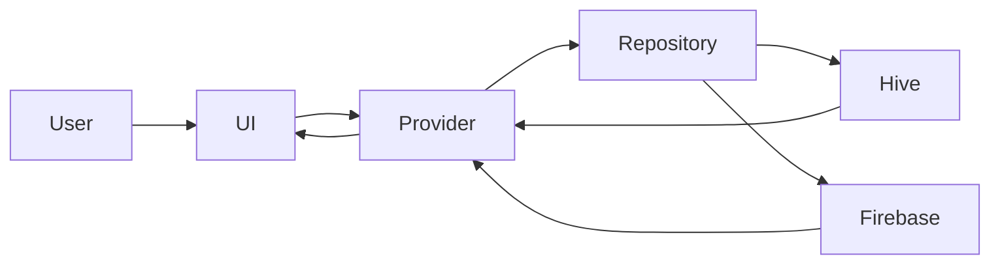
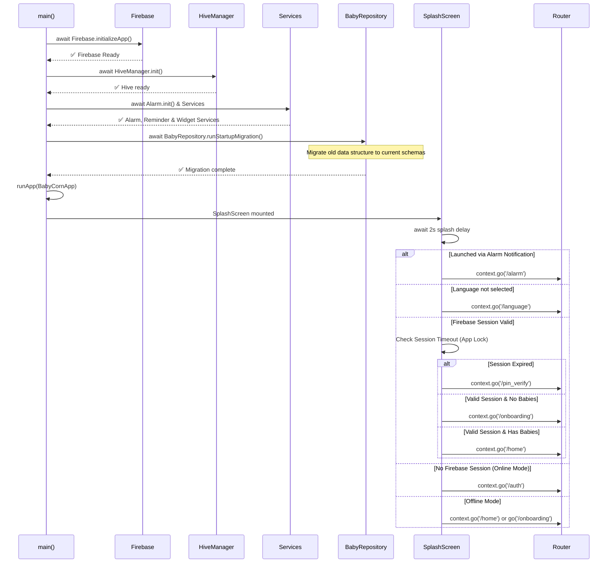
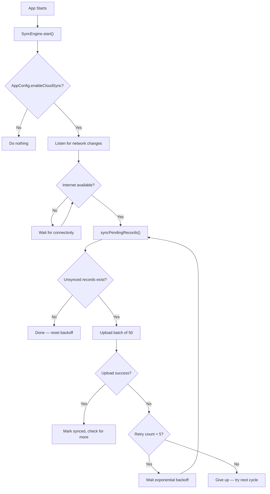

# Baby Corn

> A soft, minimal, offline-first newborn baby tracking and parenting companion app built with Flutter — designed for real parenting moments.

Baby Corn helps parents log feeding sessions, sleep durations, diaper changes, baths, and tummy time — all with a calm, distraction-free experience. The app works completely offline and optionally syncs to the cloud.

---

## ✨ Features

### 🍼 Baby Activity Tracking

| Activity | Details |
|---|---|
| **Feeding** | Log left/right breast feeds or bottle feeds with live timer |
| **Sleep** | Track sleep sessions with a floating overlay timer — visible across all screens |
| **Diaper** | Log wet, dirty, or mixed diaper changes |
| **Bath** | Record bath type, hair washing, and lotion application |
| **Tummy Time** | Track tummy time sessions with duration |

### 📊 Dashboard & Insights

- **Today's Overview** — Daily summary card showing total sleep, feed count, and diaper count
- **Recent Activity Feed** — Scrollable timeline of the last few logged events
- **Baby Age Display** — Automatically shows baby's age in days, weeks, or months
- **Multi-Baby Switcher** — Switch between multiple baby profiles from the home screen

### ⏱️ Live Timer System

- **Floating Timer Overlay** — A persistent, movable overlay window that floats over other apps during active feeding or sleep sessions (Android overlay permission)
- **Active Session Tracking** — Timers persist while navigating across screens
- **Session Guard** — Warns before switching baby profiles when a timer is running

### 📅 Records Timeline & Smart Logging

- Full chronological activity log filterable by activity type
- Detailed metadata per record (duration, side, diaper type, etc.)
- **Smart Record Merging** — Intelligently detects and merges overlapping feed and sleep records (e.g., combines 'Left Breast' and 'Right Breast' if logged consecutively)

### 💊 Medication Tracking

- **Medication Dashboard** — Add and manage baby medications with dosage and schedule
- **Medication History** — Full history log of all administered doses
- **Dosage Logging** — Track when and how much medication was given

### 🔔 Smart Reminders

- Local push notifications powered by `flutter_local_notifications`
- Configurable reminder timing
- Notification channel management per platform

### 🔒 Security & Privacy

- **Biometric Authentication** — Fingerprint / face unlock via `local_auth`
- **Session Timeout** — Configurable auto-lock (Immediately / 1m / 5m / 30m / Never)
- **Secure Local Storage** — Sensitive data stored using `flutter_secure_storage`
- **Screen Security** — Screenshot and screen recording protection via `flutter_windowmanager_plus`
- No unnecessary tracking or third-party analytics by default

### ☁️ Cloud & Backup

- **Google Sign-In** — Optional authentication with Firebase
- **Local Backup / Restore** — Export and import your data as a JSON backup file
- **Background Cloud Sync Engine** — Syncs unsynced records to Firestore with exponential backoff retry logic (configurable via `AppConfig`)
- **Offline-First Architecture** — App is fully functional with no internet connection; cloud sync is optional

### 🎨 App Customization & Social

- **Dark / Light / System Theme** — Full dark mode support
- **Manage Babies** — Add, edit, or remove baby profiles (name, birth date, weight, gender, feeding type)
- **Overlay Permission Toggle** — Enable/disable the floating timer overlay from settings
- **Family Sharing** — Share baby milestones and logs via native SMS directly to contacts

### 🌍 Localization

Supported languages out of the box:

| Language | Code |
|---|---|
| English | `en` |
| Hindi | `hi` |
| Bengali | `bn` |
| Tamil | `ta` |
| Telugu | `te` |
| Kannada | `kn` |

---

## 🧸 Product Vision

Baby Corn is being built to become:

- A **newborn baby tracker** for the first 0–24 months
- A **parenting companion** with guided insights
- A **baby development guide** with milestone tracking
- An **Indian-focused parenting app** with culturally relevant content

---

## 📱 Screens

| Screen | Description |
|---|---|
| **Splash** | App initialization and auth routing |
| **Auth** | Google Sign-In or offline mode |
| **PIN Verify** | Biometric unlock screen |
| **Onboarding** | Baby profile creation wizard |
| **Home (Launchpad)** | Dashboard with quick-log buttons, daily summary, recent activity |
| **Records Timeline** | Full activity log with filters |
| **Feeding Entry** | Log a feeding session with side and duration |
| **Sleep Entry** | Log a sleep session with live timer |
| **Diaper Entry** | Log diaper type |
| **Bath Entry** | Log bath details |
| **Mood Entry** | Log baby's mood |
| **Medication Dashboard** | View and manage active medications |
| **Medication History** | Full medication dosage log |
| **Vaccination Tracker** | Track vaccinations by schedule |
| **Doctor Appointments** | Manage upcoming doctor visits |
| **Guide** | Parenting hub featuring First Foods, 16 Sanskars, Baby Cry Language, and Baby Rashes guides |
| **First Foods** | Food library, puree recipes, and introduction tracker |
| **Food Tracker** | Track which foods have been introduced |
| **Development** | Baby milestones and photo moments |
| **Statistics** | Activity statistics and trends |
| **Account & Settings** | Profile, theme, language, app lock, family management |
| **Manage Babies** | Add and manage multiple baby profiles |
| **Subscription** | Premium subscription management |

---

# Deep Dive Architecture Guide

This section explains every technology, pattern, and design decision in Baby Corn. It is written so that someone who has never used Flutter, Dart, Riverpod, Hive, or Firebase can understand the entire project just by reading this document.

---

## What is Flutter?

Flutter is Google's open-source framework for building apps that run on multiple platforms from a single codebase.

One codebase produces:

- Android App
- iPhone App
- Tablet App
- Desktop App
- Web App

Instead of writing separate code for Android (Java/Kotlin) and iOS (Swift), you write one set of code and Flutter compiles it for each platform.

Baby Corn currently targets **Android** and **iOS**.

---

## What is Dart?

Dart is Google's programming language. It is the language you write Flutter apps in.

If you know any of these languages, Dart will feel familiar:

- Java
- Kotlin
- TypeScript
- C#

Key characteristics:

- **Strongly typed** — Variables have types (`String`, `int`, `List<String>`)
- **Async/await** — Built-in support for asynchronous operations (network calls, file I/O)
- **Null safety** — The compiler prevents null pointer errors at compile time
- **Hot reload** — Change code and see the result instantly without restarting the app

Every file in the `lib/` directory ending in `.dart` is a Dart source file.

---

## What is Riverpod?

Riverpod is the **state management system** used by Baby Corn.

Think of Riverpod as the app's memory manager. It keeps track of data and makes sure every screen shows the latest information.

**Without Riverpod:**

```
User changes baby name
↓
Settings screen updates
↓
But Home screen still shows old name
↓
User has to restart the app
```

**With Riverpod:**

```
User changes baby name
↓
Provider updates the data
↓
Home screen refreshes automatically
↓
Statistics screen refreshes automatically
↓
Settings screen refreshes automatically
↓
Every screen shows the new name instantly
```

In Baby Corn, Riverpod **Providers** are the bridge between the data layer (where information is stored) and the presentation layer (what the user sees). When data changes, every screen listening to that provider rebuilds itself automatically.

### How Providers work in Baby Corn

```
Provider = a named container that holds data

Example:
  activeBabyProvider    → holds the currently selected baby
  recordsProvider       → holds all activity records
  themeModeProvider     → holds the current theme (dark/light)
  localeProvider        → holds the current language
```

Screens "watch" providers. When the data inside a provider changes, the screen rebuilds.

---

## What is Hive?

Hive is a **lightweight NoSQL database** that stores data directly on the user's phone.

Instead of storing data on a server:

```
Data is stored locally on the device's file system.
```

Advantages:

- **Works offline** — No internet connection required
- **Extremely fast** — Data reads and writes are near-instant
- **No server cost** — Zero backend infrastructure needed
- **Privacy** — Data never leaves the device unless the user explicitly enables cloud sync

How it works:

```
User logs a feeding
↓
Hive saves the feeding record to a local file
↓
Data is available instantly
↓
No network call needed
```

Hive organizes data into **Boxes** (think of them as tables in a traditional database). Each box stores a specific type of data. See the [Database Structure](#-database-structure) section for all boxes.

---

## What is Firebase?

Firebase is Google's **Backend-as-a-Service**. It provides cloud infrastructure so developers don't have to build and maintain their own servers.

Firebase provides:

| Service | Purpose in Baby Corn |
|---|---|
| **Firebase Auth** | Google Sign-In for user accounts |
| **Cloud Firestore** | Cloud database for syncing records across devices |
| **Firebase Storage** | File and asset storage |
| **Firebase Analytics** | Usage analytics |
| **Firebase Crashlytics** | Crash reporting |
| **Firebase App Check** | Protects against API abuse (Play Integrity on production, Debug provider on development) |

**Important:** Baby Corn uses Firebase **only when cloud features are enabled**. The app is fully functional without any Firebase services — this is called "Offline-First" design.

---

## 🛠 Tech Stack

### Frontend
- **Flutter** (SDK `>=3.2.0`)
- **Material 3** design system
- **Google Fonts** (`Outfit` family) for premium typography
- **flutter_animate** for smooth micro-animations
- **glassmorphism** for modern UI effects
- **flutter_svg** for scalable vector icons

### State Management
- **Riverpod** (`flutter_riverpod ^2.4.9`) — feature-scoped providers

### Routing
- **GoRouter** (`^17.2.3`) — declarative navigation with deep linking

### Backend (Optional)
- **Firebase Core** — platform initialization
- **Firebase Auth** — Google Sign-In
- **Cloud Firestore** — cloud record storage
- **Firebase Storage** — file and asset storage
- **Firebase Analytics** — usage analytics
- **Firebase Crashlytics** — crash reporting
- **Firebase App Check** — Play Integrity (production) / Debug (development)

### Local Storage
- **Hive** (`^2.2.3`) — fast local NoSQL database for records and sessions
- **flutter_secure_storage** — encrypted storage for PIN, tokens, and settings

### Security & Biometrics
- **local_auth** — fingerprint / face biometric unlock
- **flutter_windowmanager_plus** — screen capture prevention

### Notifications
- **flutter_local_notifications** — local push notifications and reminders
- **alarm** — reliable alarm scheduling that survives app kill

### Utilities
- **connectivity_plus** — network state detection for sync engine
- **geolocator** — location permissions (reserved for future features)
- **image_picker** — baby photo support
- **cached_network_image** — profile photo caching
- **share_plus** — backup sharing
- **file_picker** — backup import
- **uuid** — unique record ID generation
- **intl** — date/time formatting and localization

---

## 🧠 Architecture

Baby Corn follows **Clean Architecture** with a **feature-first folder structure**.

### Clean Architecture Layers

Every feature in Baby Corn is split into three layers:

```
Presentation Layer (What the user sees)
│
├── Screens        → Full pages the user navigates to
├── Widgets        → Reusable UI components within screens
└── Providers      → Riverpod providers that connect UI to data

Domain Layer (Business rules)
│
├── Models         → Data structures (e.g., RecordModel, BabyModel)
└── Entities       → Core business objects

Data Layer (Where data lives)
│
├── Repositories   → Classes that read/write data
├── Hive           → Local database storage
└── Firebase       → Cloud database storage (optional)
```

**Why this matters:**

```
User taps "Save Feed"
↓
Presentation Layer: Screen calls Provider
↓
Provider calls Repository
↓
Data Layer: Repository validates and saves to Hive
↓
Provider notifies all listening screens
↓
Presentation Layer: UI updates instantly
```

Each layer only talks to the layer directly below it. Screens never access Hive directly. Repositories never build UI. This separation makes the code easier to test, debug, and modify.

### System Architecture Diagram



### How Data Flows Through Baby Corn

Step by step example — user logs a feeding:

```
1. User presses "Save Feed" on FeedingEntryScreen
       ↓
2. Screen calls ref.read(recordsProvider.notifier).addRecord(feed)
       ↓
3. Provider receives the action
       ↓
4. Provider calls RecordRepository.saveRecord(feed)
       ↓
5. Repository validates the data
       ↓
6. Repository writes to Hive (local database)
       ↓
7. UI updates instantly — timeline shows the new feed
       ↓
8. If cloud sync is enabled:
       ↓
9. SyncEngine detects unsynced record
       ↓
10. SyncEngine uploads to Firestore in the background
```

---

## 📁 Folder Structure Explained

```
lib/
├── core/                    # Shared infrastructure used by all features
│   ├── config/              # AppConfig feature flags (Firebase, sync, auth)
│   ├── constants/           # App constants
│   ├── design/              # Design system
│   │   ├── components/      # Reusable styled components
│   │   ├── extensions/      # Dart extension methods for styling
│   │   ├── layouts/         # Layout widgets (CustomAppBar, FloatingTimerOverlay)
│   │   └── tokens/          # Design tokens (colors, typography, theme data)
│   ├── local_storage/       # Hive database manager and SecureStorage manager
│   ├── native/              # Native platform integrations
│   │   ├── alarm/           # Native alarm channel
│   │   ├── calling/         # Phone call integration
│   │   ├── contacts/        # Contacts access
│   │   ├── notifications/   # Notification channels
│   │   └── sms/             # SMS messaging
│   ├── providers/           # Global Riverpod providers (locale)
│   ├── router/              # GoRouter navigation — all app routes defined here
│   ├── services/            # Background services
│   │   ├── alarm_service    # Reliable alarm scheduling
│   │   ├── backup_service   # JSON backup import/export
│   │   ├── biometric_service # Fingerprint/face authentication
│   │   ├── haptic_service   # Vibration feedback
│   │   ├── notification_service # Push notification management
│   │   ├── permission_service # Runtime permission handling
│   │   ├── reminder_service # Scheduled reminder system
│   │   ├── security_service # Screenshot protection
│   │   ├── sync_engine      # Background Firestore sync with exponential backoff
│   │   ├── sync_service     # Cloud data sync operations
│   │   └── widget_service   # Home screen widget updates
│   ├── theme/               # Theme definitions and glass-morphism system
│   ├── utils/               # Utility functions and helpers
│   └── widgets/             # Shared global widgets
│       ├── app_lifecycle_wrapper  # Handles app lock on resume
│       ├── bouncing_button        # Animated tap button
│       ├── full_screen_image_viewer # Image zoom viewer
│       ├── liquid_background      # Animated liquid background effect
│       └── safe_scrollable_wrapper # Scroll safety wrapper
│
├── features/                # Feature modules — each follows Clean Architecture
│   ├── auth/                # Authentication & baby model
│   │   ├── data/repositories/   # BabyRepository (Hive CRUD for babies)
│   │   ├── domain/models/       # BabyModel
│   │   └── presentation/
│   │       ├── providers/       # activeBabyProvider, allBabiesProvider
│   │       └── screens/         # SplashScreen, AuthScreen, PinScreen, LanguageSelectionScreen
│   │
│   ├── dashboard/           # Home screen
│   │   └── presentation/
│   │       └── screens/         # MainScaffold, LaunchpadScreen
│   │
│   ├── development/         # Baby development milestones & photo moments
│   │   ├── domain/models/       # MomentModel
│   │   └── presentation/
│   │       ├── screens/         # DevelopmentScreen, ImageViewerScreen
│   │       └── widgets/         # AddMomentSheet
│   │
│   ├── guide/               # Parenting guide content
│   │   ├── data/                # Guide data sources
│   │   ├── domain/models/       # SanskarModel, FoodLibraryItem, FoodIntroRecord
│   │   └── presentation/
│   │       ├── providers/       # FoodTrackerProvider
│   │       ├── screens/         # GuideScreen, FirstFoodsScreen, SanskarJourneyScreen,
│   │       │                    # BabyCryLanguageScreen, BabyRashesScreen, FoodTrackerScreen
│   │       └── widgets/         # FoodLibraryTab, PureeRecipeList, SanskarDetailSheet
│   │
│   ├── medication/          # Medication tracking
│   │   ├── data/repositories/   # MedicationRepository
│   │   ├── domain/models/       # MedicationModel, MedicationLogModel
│   │   └── presentation/
│   │       ├── screens/         # MedicationDashboardScreen, MedicationHistoryScreen, AddMedicationScreen
│   │       └── widgets/         # MedicationCard
│   │
│   ├── onboarding/          # Baby profile setup wizard
│   │   └── presentation/
│   │       └── screens/         # OnboardingScreen
│   │
│   ├── records/             # Core activity logging
│   │   ├── data/repositories/   # RecordRepository, FirestoreRecordRepository
│   │   ├── domain/models/       # RecordModel, ActiveSessionModel
│   │   └── presentation/
│   │       ├── providers/       # recordsProvider, activeSessionProvider
│   │       ├── screens/         # RecordsTimelineScreen, FeedingEntryScreen, SleepEntryScreen,
│   │       │                    # DiaperEntryScreen, BathEntryScreen, MoodEntryScreen,
│   │       │                    # VaccinationTrackerScreen, DoctorAppointmentsScreen
│   │       └── widgets/         # TimelineTile, AddRecordModal, FeedingOptionsSheet
│   │
│   ├── reminders/           # Reminder management
│   │
│   ├── settings/            # Account & app settings
│   │   ├── data/repositories/   # SettingsRepository (theme, language)
│   │   ├── domain/models/       # FamilyMemberModel
│   │   └── presentation/
│   │       ├── providers/       # themeModeProvider, premiumProvider
│   │       ├── screens/         # AccountScreen, ManageBabiesScreen, EditBabyScreen,
│   │       │                    # RemindersSettingScreen, ReminderDetailScreen,
│   │       │                    # SubscriptionScreen, FamilySharingScreen,
│   │       │                    # AlarmScreen, DiagnosticsScreen
│   │       └── widgets/         # SyncDetailsSheet
│   │
│   └── statistics/          # Activity statistics & charts
│       └── presentation/
│           └── screens/         # StatisticsScreen
│
├── l10n/                    # Localization
│   ├── app_en.arb           # English strings
│   ├── app_hi.arb           # Hindi strings
│   ├── app_bn.arb           # Bengali strings
│   ├── app_ta.arb           # Tamil strings
│   ├── app_te.arb           # Telugu strings
│   ├── app_kn.arb           # Kannada strings
│   └── app_localizations.dart  # Generated localization delegates
│
└── main.dart                # App entry point
```

### Core Folder Details

#### `core/config/`

Contains `AppConfig` — a single file with boolean flags that control the entire app's behavior:

```dart
enableFirebase     = true   // Master switch for all Firebase services
enableFirebaseAuth = true   // Require Google Sign-In (false = offline-only)
enableCloudSync    = true   // Background Firestore sync engine
enableCloudBackup  = false  // Cloud backup UI in settings
```

Changing these flags at compile time switches the app between online and offline modes without changing any other code.

#### `core/router/`

Responsible for navigation. All routes are defined in one file (`app_router.dart`).

```
User taps "Statistics"
↓
Router navigates from HomeScreen to StatisticsScreen
↓
StatisticsScreen opens with a smooth page transition
```

Every screen in the app has a route path (e.g., `/home`, `/feeding-entry`, `/settings/reminders`).

#### `core/services/`

Background services that run independently of any screen:

| Service | What it does |
|---|---|
| `alarm_service` | Schedules reliable alarms that survive app kill |
| `backup_service` | Exports all data as JSON, imports JSON backups |
| `biometric_service` | Authenticates user via fingerprint or face |
| `haptic_service` | Provides vibration feedback on button taps |
| `notification_service` | Manages push notification channels and delivery |
| `permission_service` | Handles runtime permission requests (camera, notifications, etc.) |
| `reminder_service` | Schedules and manages recurring reminders |
| `security_service` | Enables/disables screenshot protection |
| `sync_engine` | Syncs unsynced Hive records to Firestore in background |
| `sync_service` | Handles full cloud-to-local and local-to-cloud data sync |
| `widget_service` | Updates Android home screen widgets |

#### `core/widgets/`

Shared widgets used across multiple features:

| Widget | What it does |
|---|---|
| `AppLifecycleWrapper` | Detects when the app goes to background/foreground, triggers app lock check |
| `BouncingButton` | Animated button with scale-down effect on tap |
| `FullScreenImageViewer` | Pinch-to-zoom image viewer |
| `LiquidBackground` | Animated gradient background effect |
| `SafeScrollableWrapper` | Prevents scroll conflicts in nested scrollable areas |

### Feature Folder Details

Each feature follows the same internal structure:

```
feature_name/
├── data/
│   └── repositories/    # Classes that read/write data (Hive, Firebase)
├── domain/
│   └── models/          # Data structures (what a record, baby, or medication looks like)
└── presentation/
    ├── providers/       # Riverpod providers (state management)
    ├── screens/         # Full-page UI screens
    └── widgets/         # Reusable UI components for this feature
```

#### `features/auth/`

Handles user authentication and baby profile management.

- **BabyRepository** — CRUD operations for baby profiles stored in Hive
- **BabyModel** — Data structure for a baby (name, birth date, weight, gender, feeding type)
- **SplashScreen** — First screen shown; handles routing based on auth state and session timeout
- **AuthScreen** — Google Sign-In or offline mode selection

#### `features/records/`

The core feature. Stores every baby activity.

Includes logging for:
- Feeding (breast left/right, bottle, duration)
- Sleep (start/end time, duration)
- Diaper (wet, dirty, mixed)
- Bath (bath type, hair wash, lotion)
- Mood (baby's emotional state)
- Tummy Time

Data flow:

```
User logs a feed
↓
RecordModel created with unique ID, timestamp, type, metadata
↓
RecordRepository saves to Hive
↓
recordsProvider refreshes
↓
Timeline screen updates instantly
```

#### `features/medication/`

Manages baby medications, dosages, and administration logs.

- **MedicationModel** — Medicine name, dosage, frequency, start/end dates
- **MedicationLogModel** — Individual dose log entries (when, how much)
- **MedicationDashboard** — Overview of active medications
- **MedicationHistory** — Full chronological dose log

#### `features/guide/`

Parenting guide content:

- **First Foods** — Food library with images, single to 4-ingredient puree recipes, food tracker
- **16 Sanskars** — Indian traditional ceremonies and rituals guide
- **Baby Cry Language** — Decoding baby cry patterns
- **Baby Rashes** — Visual guide to common baby skin conditions

#### `features/development/`

Baby milestone tracking and photo moments.

- **MomentModel** — A captured milestone moment (photo, description, date)
- **DevelopmentScreen** — Grid view of milestone photos
- **ImageViewerScreen** — Full-screen photo viewer with hero animation

#### `features/settings/`

Account and app configuration:

- Theme switching (Dark / Light / System)
- Language selection
- App lock timeout configuration
- Baby profile management
- Family sharing
- Subscription management
- Alarm configuration

---

## 🗄 Database Structure

Baby Corn uses **Hive** for local storage. Data is organized into **Boxes** (similar to tables in a SQL database).

| Box | Type | Purpose | Key Structure |
|---|---|---|---|
| `baby_profile` | Dynamic | Baby profiles and active baby ID | `babies_list`, `active_baby_id` |
| `records` | `RecordModel` | All activity records (feeds, sleep, diaper, bath, mood) | UUID string keys |
| `settings` | Dynamic | App settings (theme, language) | `theme_mode`, `language` |
| `reminders` | Dynamic | Reminder configuration | Category-based keys |
| `cached_stats` | Dynamic | Pre-computed statistics cache | Date-range keys |
| `sync_queue` | Dynamic | Records waiting to be synced to cloud | Record ID keys |
| `active_session` | `ActiveSessionModel` | Currently running timers (feeding, sleep) | Session type keys |
| `sanskars` | `SanskarModel` | 16 Sanskar ceremony tracking | Sanskar ID keys |
| `moments` | `MomentModel` | Baby development milestone photos | UUID string keys |
| `medications` | `MedicationModel` | Active and past medications | UUID string keys |
| `medication_logs` | `MedicationLogModel` | Medication dose administration log | UUID string keys |
| `family_members` | `FamilyMemberModel` | Shared family member profiles | UUID string keys |
| `food_tracker` | `FoodIntroRecord` | Food introduction tracking | Food name keys |

### Secure Storage (Encrypted)

Sensitive data is stored separately using `flutter_secure_storage` (encrypted, not in Hive):

| Key | Purpose |
|---|---|
| `user_pin` | User's app lock PIN |
| `session_timeout` | Auto-lock timeout setting (default: 5 minutes) |
| `last_active_time` | Timestamp of last user activity |
| `biometric_enabled` | Whether biometric unlock is enabled |
| `screenshot_protection` | Whether screenshot blocking is active |
| `pin_failed_attempts` | Brute force protection counter |
| `pin_lockout_until` | Lockout timestamp after too many failed PIN attempts |
| `otp_attempts_timestamps` | OTP abuse prevention |
| `otp_lockout_until` | OTP lockout timestamp |

---

## 🚀 Startup Lifecycle

The startup flow is **strictly sequential** — each step is `await`ed before the next begins. This eliminates race conditions between data migration and routing.



> **Single Source of Truth:** The app intelligently delegates routing based on Firebase Auth state, the local Hive database (`babies_list`), and session expiry status.

---

## 🔐 Security Model

### App Lock Flow

Baby Corn protects sensitive baby data with an automatic app lock system:

```
App goes to background (user switches to another app)
    ↓
AppLifecycleWrapper records timestamp
    ↓
User returns to Baby Corn
    ↓
AppLifecycleWrapper checks: Has the timeout expired?
    ↓
    ├── NO → App resumes normally
    │
    └── YES → Is biometric authentication enabled?
              ↓
              ├── YES → Prompt fingerprint/face scan
              │         ↓
              │         ├── Success → Unlock and resume
              │         └── Failure → Navigate to PIN verify screen
              │
              └── NO → Navigate to PIN verify screen
```

### Session Timeout Options

| Setting | Behavior |
|---|---|
| Immediately | Lock every time the app goes to background |
| 1 minute | Lock after 1 minute of inactivity |
| 5 minutes | Lock after 5 minutes (default) |
| 30 minutes | Lock after 30 minutes |
| Never | Never auto-lock |

### Brute Force Protection

- Failed PIN attempts are counted
- After repeated failures, the app enters a lockout period
- Lockout duration increases with each subsequent failure

---

## 🔄 Sync Engine (Offline-First Design)

Baby Corn follows an **Offline-First** architecture. This means:

1. All data is saved locally **first**
2. The app works **perfectly without internet**
3. Cloud sync happens **in the background** when internet is available

### How Sync Works

```
User logs a feeding
    ↓
Record saved to Hive (isSynced = false)
    ↓
UI updates instantly
    ↓
SyncEngine checks: Is internet available?
    ↓
    ├── YES → Upload record to Firestore
    │         ↓
    │         Mark record as isSynced = true
    │
    └── NO → Record stays in queue
              ↓
              Later: Internet becomes available
              ↓
              SyncEngine wakes up automatically
              ↓
              Uploads all queued records
```

### Sync Engine Details

| Property | Value |
|---|---|
| **Trigger** | App start, network reconnection, every 5 minutes |
| **Batch size** | 50 records per sync cycle |
| **Deduplication** | Records deduplicated by UUID before upload |
| **Retry strategy** | Exponential backoff (2s, 4s, 8s, 16s, 32s) |
| **Max retries** | 5 attempts before giving up |
| **Master switch** | `AppConfig.enableCloudSync` (disabled = sync never runs) |

### Network Recovery



---

## Feature Flags (`AppConfig`)

| Flag | Default | Description |
|---|---|---|
| `enableFirebase` | `true` | Master switch for all Firebase services |
| `enableFirebaseAuth` | `true` | Require Google Sign-In (false = offline-only mode) |
| `enableCloudSync` | `true` | Background Firestore sync engine |
| `enableCloudBackup` | `false` | Cloud backup UI in settings |

---

## Feature Dependency Graph

```
Dashboard (Home)
├── Records          # Activity logging
├── Statistics       # Charts and trends
├── Development      # Milestones & photos
├── Guide            # Parenting content
├── Medication       # Medicine tracking
└── Reminders        # Notification scheduling

Settings
├── Theme            # Dark / Light / System
├── Language          # 6 Indian languages
├── App Lock          # Biometric + timeout
├── Family Sharing    # SMS sharing
├── Manage Babies     # Multi-baby profiles
└── Subscription      # Premium features

Auth
├── Google Sign-In   # Firebase Authentication
├── Offline Mode     # Skip sign-in
└── Session Mgmt     # App lock timeout
```

---

## 🔧 Development Lifecycle

When a new feature is added to Baby Corn, this is the sequence of steps:

```
1. Create Feature Folder
   └── features/new_feature/
       ├── data/repositories/
       ├── domain/models/
       └── presentation/
           ├── providers/
           ├── screens/
           └── widgets/

2. Define Data Model
   └── domain/models/new_model.dart
   └── Register Hive adapter in HiveManager

3. Create Repository
   └── data/repositories/new_repository.dart
   └── Add Hive box constant in HiveManager

4. Create Provider
   └── presentation/providers/new_provider.dart
   └── Connect to repository

5. Build Screen
   └── presentation/screens/new_screen.dart
   └── Watch providers for reactive UI

6. Add Route
   └── core/router/app_router.dart
   └── Add GoRoute for the new screen

7. Add Localization
   └── l10n/app_en.arb (and other language files)
   └── Run flutter gen-l10n

8. Test & Build
   └── flutter run (development)
   └── flutter build apk --release (production)
```

---

## 🏗 Future Architecture

Planned modules and where they will live:

```
features/
├── vaccination/       # Vaccination schedule tracking with reminders
├── growth/            # Weight/height charts with percentile curves
├── ai_assistant/      # AI-powered parenting assistant
├── reports/           # Doctor-ready PDF report generation
├── subscriptions/     # Premium subscription management
└── communication/     # In-app calling, messaging, and video calling
```

---

## 🚀 Getting Started

### Prerequisites

- Flutter SDK `>=3.2.0 <4.0.0`
- Android Studio or VS Code with Flutter extension
- A Firebase project (optional for offline-only mode)
- Android device or emulator (API 21+)

### Installation

```bash
git clone https://github.com/iamPrashanta/baby-corn-apk.git
cd baby-corn-apk
flutter pub get
dart run build_runner build --delete-conflicting-outputs
```

### Firebase Setup (Optional)

If you want cloud features (auth, Firestore sync):

```bash
# Install the Firebase CLI and FlutterFire CLI
dart pub global activate flutterfire_cli

# Configure Firebase for your project
flutterfire configure
```

Then copy `.env.example` to `.env` and fill in your API keys:

```bash
cp .env.example .env
```

To run in **fully offline mode** without Firebase, set in `lib/core/config/app_config.dart`:

```dart
static const bool enableFirebase = false;
static const bool enableFirebaseAuth = false;
```

### Run the App

```bash
flutter run
```

### Build Optimized Release Versions

#### Android (APK)

To build the smallest, most optimized APKs for Android, run:

```bash
flutter build apk --release --split-per-abi --obfuscate --split-debug-info=./debug_info
```

**Which APK should you use?**
The `--split-per-abi` flag will generate multiple APKs in `build/app/outputs/flutter-apk/`. 
- **`app-arm64-v8a-release.apk`**: Use this for 99% of modern Android phones.
- **`app-armeabi-v7a-release.apk`**: Use this for older, 32-bit Android phones.
- **`app-x86_64-release.apk`**: Use this for Android emulators on PC.

> **Note for Windows developers**: See [`docs/android-build-aapt2-windows-fix.md`](docs/android-build-aapt2-windows-fix.md) if you encounter AAPT2 build errors on Windows.

#### iOS (IPA)

To build a release archive for iOS, there are strict prerequisites mandated by Apple.

**Prerequisites to build for iOS:**
1. **A Mac Computer**: Apple strictly requires macOS to compile iOS apps. You cannot build an iOS app on Windows or Linux natively.
2. **Xcode**: Download and install Xcode from the Mac App Store.
3. **Apple Developer Account**: To install the app on a physical iPhone or distribute it, you need an Apple Developer account (a free account allows testing on your own device; a $99/year paid account is required for App Store/TestFlight distribution).
4. **CocoaPods**: Ensure CocoaPods is installed (`sudo gem install cocoaPods`) to handle iOS dependencies.

**Build Command:**
Once you are on a Mac and have opened the `ios/Runner.xcworkspace` in Xcode at least once to configure your developer signing certificate, you can run:

```bash
flutter build ipa --obfuscate --split-debug-info=./debug_info
```

This generates an `.xcarchive` and an `.ipa` file located in `build/ios/ipa/`, which you can distribute via TestFlight or upload to the App Store.
---

## 🔑 Permissions (Android)

| Permission | Purpose |
|---|---|
| `SYSTEM_ALERT_WINDOW` | Floating timer overlay over other apps |
| `RECEIVE_BOOT_COMPLETED` | Reschedule reminders after reboot |
| `POST_NOTIFICATIONS` | Local push notifications |
| `USE_BIOMETRIC` | Fingerprint/face app unlock |
| `INTERNET` | Firebase cloud sync |
| `ACCESS_NETWORK_STATE` | Offline/online detection |

---

## 📌 Roadmap

### Planned Features

- [ ] Growth tracking (weight/height charts)
- [ ] Teething tracker
- [ ] Baby development milestone cards
- [ ] AI parenting assistant
- [ ] Family sync & multi-caregiver support
- [ ] Advanced statistics & weekly reports
- [ ] Doctor-ready PDF reports
- [ ] Smart sleep pattern insights
- [ ] 16 Sanskar & Indian parenting guide content
- [ ] Naamkaran & Annaprashan ceremony guidance
- [ ] Premium subscription tier
- [ ] Calling-Messaging-VideoCalling from app to parent or to Doctor

---

## 🤝 Contributing

Contributions, suggestions, and feedback are welcome. Please open an issue or pull request.

---

## 📄 License

MIT License — see [`LICENSE`](LICENSE) for details.

---

## ❤️ Built With Care

Designed for parents, caregivers, and growing families — especially during those quiet 3 AM moments. 🌙
