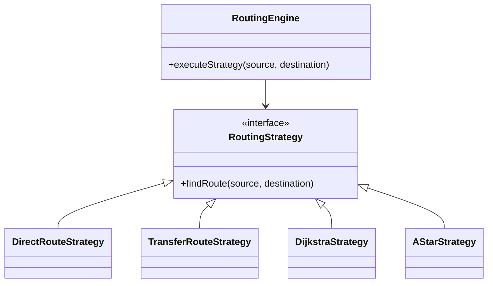

# Routing Design

## Strategy Pattern Engine

The search architecture revolves around the `RoutingEngine` which consumes a `RoutingStrategy`.



## Transfer Detection Design
Instead of performing complex SQL joins dynamically, we pre-compute transfers via physical `StopConnection` edges of type `TRANSFER`. 
If Route A and Route B both pass through "Durgapur", an edge `fromStopId = Durgapur, toStopId = Durgapur, edgeType = TRANSFER` connects the two logical routes.

## Route Ranking
Handled by the `RouteRankingService`.
```text
Score = (Time * 1.0) + (Fare * 0.5) + (Transfers * 20)
```
A lower score is strictly better. A 1-transfer route will be penalized by +20 points, requiring a direct route to be at least 20 minutes slower to be outranked.
